<p align="center">
  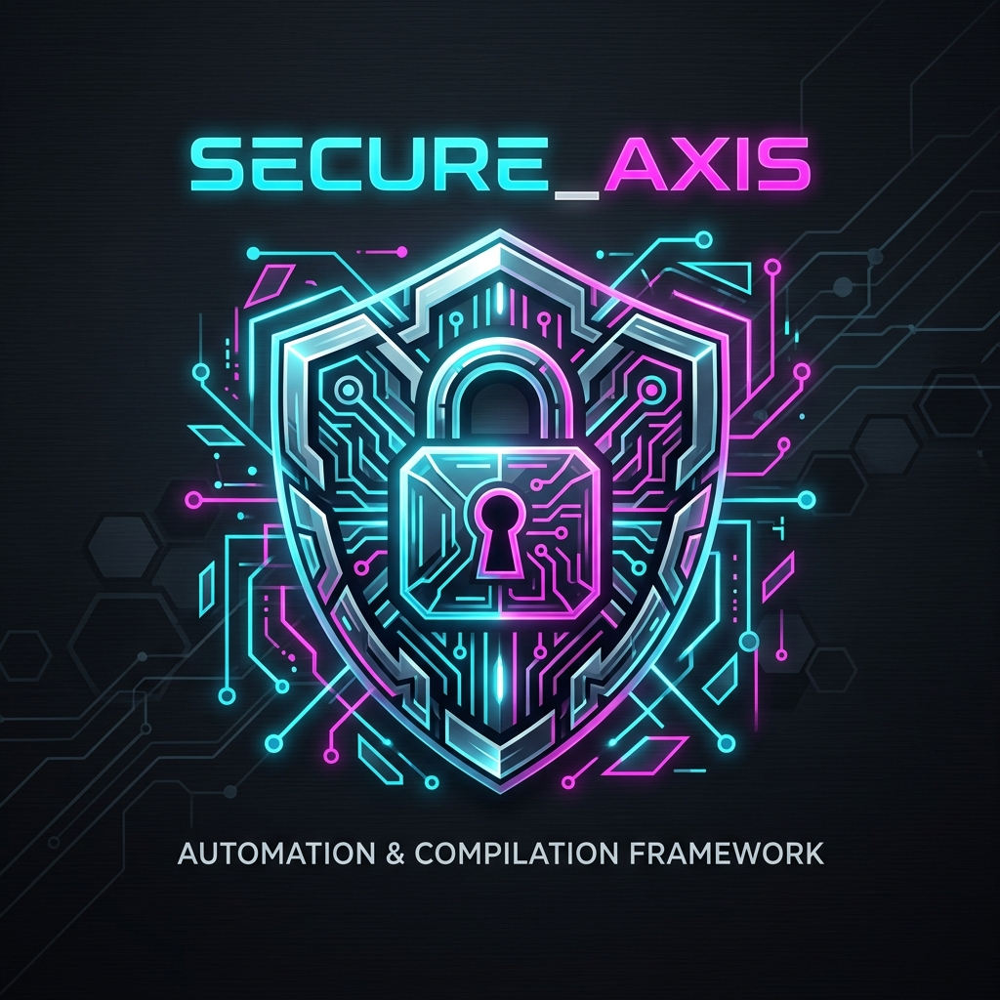
</p>

# Human-AI Hybrid Development & Compilation Framework

Welcome to the **Human-AI Hybrid Loop** workspace on the `worlock` host. This repository houses specialized modules for automated security auditing, local model telemetry, network analytics, and a custom compilation pipeline designed to securely build, deploy, and maintain core system software from upstream sources.

---

## 1. Core Philosophies & Loop Integration

This workspace operates on a transfinite synergy loop:
- **The Human ($+1$):** Directs high-level objectives, provides heuristic pruning based on semantic context, and handles anomaly triage outside formal bounds.
- **The AI ($\omega$):** Handles exhaustive source code checks, validation logic, system-level dependency tracing, and regression testing.

---

## 2. Upstream Compilation Hub

To resolve dependencies, obtain CVE security patches, and enable modern protocols (like TLS 1.3 or HTTP/3), this workspace compiles core libraries from source with strict **Rpath Isolation**. By avoiding global cache modification (`ld.so.conf.d`), we prevent version mismatches from breaking system packages.

### Component Layout
1. **OpenSSL 3.5.6 (LTS):** Installed to `/usr/local/ssl` with `rpath` baked in to point to `/usr/local/ssl/lib64`.
2. **zlib-ng 2.3.3:** Installed to `/usr/local/zlib-ng` in `zlib-compat` mode to provide standard compression symbols.
3. **cURL 8.20.0:** Installed to `/usr/local/curl` and linked dynamically to the custom OpenSSL and zlib-ng.
4. **OpenSSH 10.3p1:** Installed to `/usr/local/ssh`, compiled `--with-pam`, overriding `/usr/sbin/sshd` via systemd drop-ins.
5. **Nginx 1.30.2:** Installed to `/usr/local/sbin/nginx`, resolving custom dynamic headers, and overriding the default Ubuntu service via systemd overrides.

---

## 3. Visual Mechanics & Architecture Matrices

### 3.1. Systems & Operations Matrix (5x5)

Detailed operations, lessons, workflows, and pipelines of our compilation architecture are mapped below:

| Pillar | S.1 | S.2 | S.3 | S.4 | S.5 |
| :--- | :--- | :--- | :--- | :--- | :--- |
| **Architecture** | 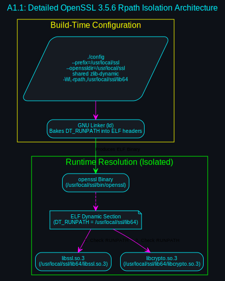 | 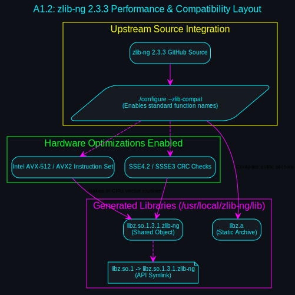 | 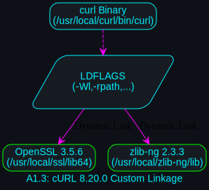 | 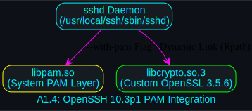 | 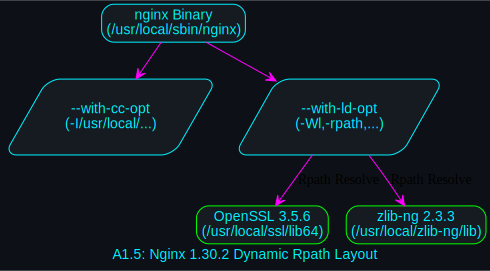 |
| **Lessons** | 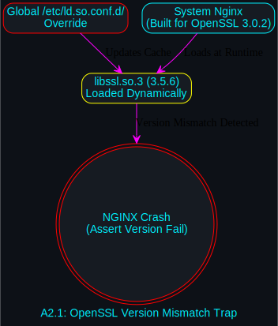 | 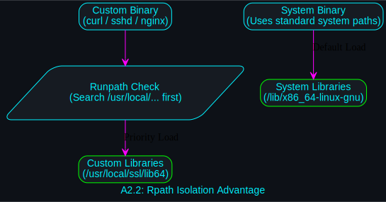 | 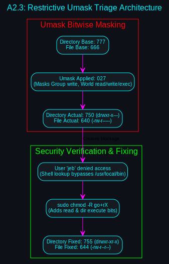 | 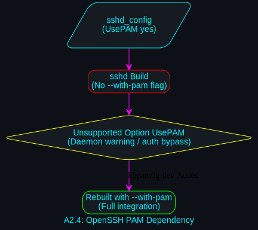 | 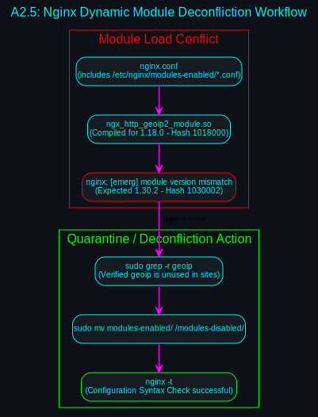 |
| **Future** | 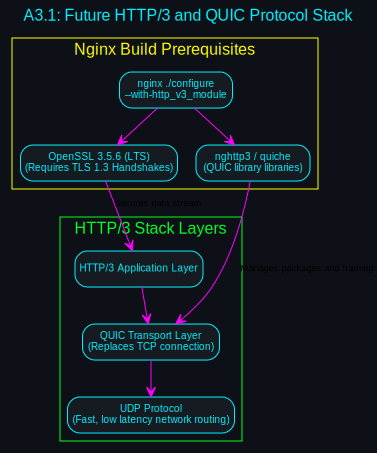 | 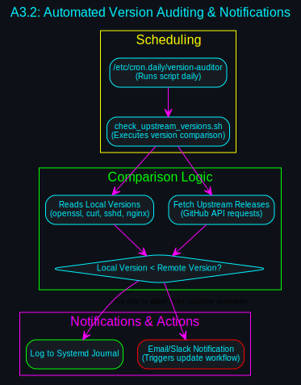 | 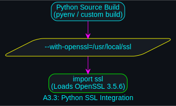 | 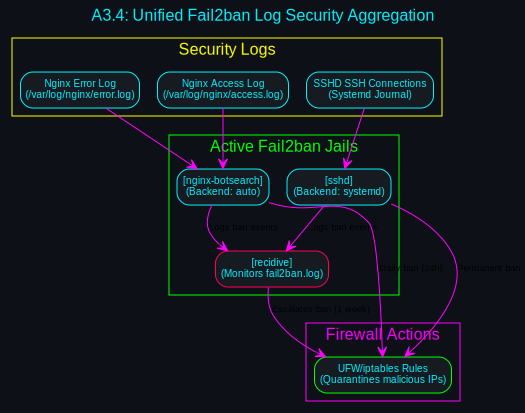 | 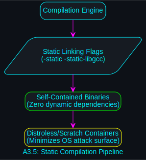 |
| **Workflows** | 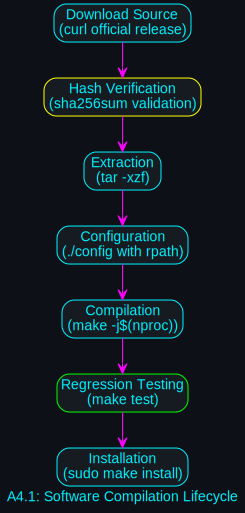 | 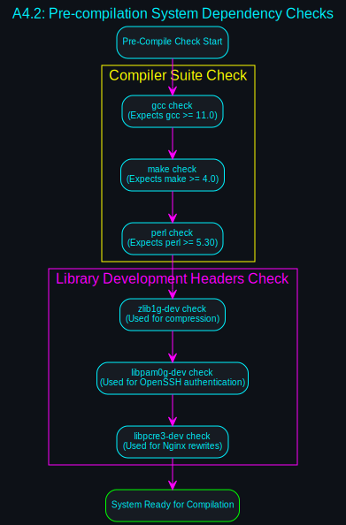 | 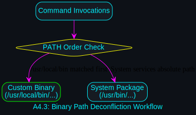 | 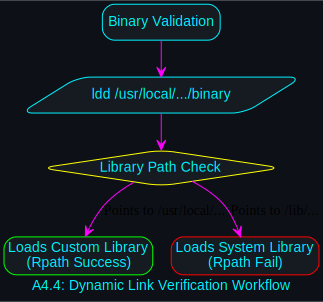 | 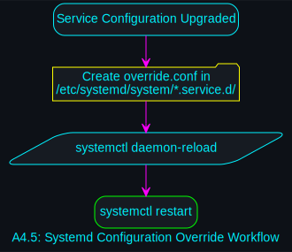 |
| **Pipelines** | 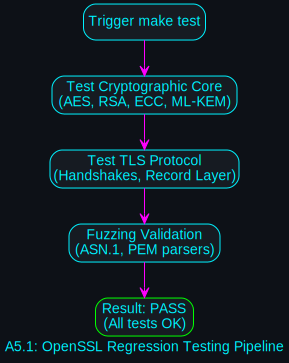 | 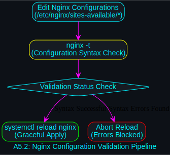 | 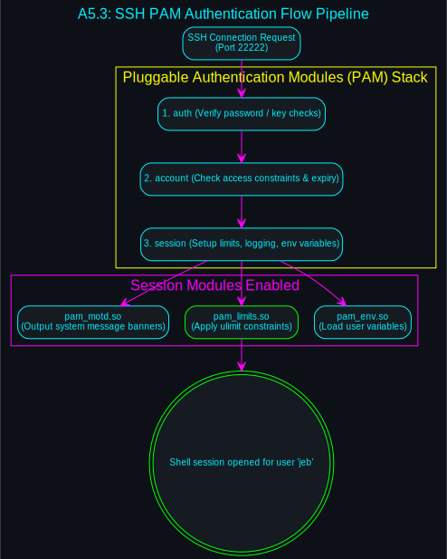 | 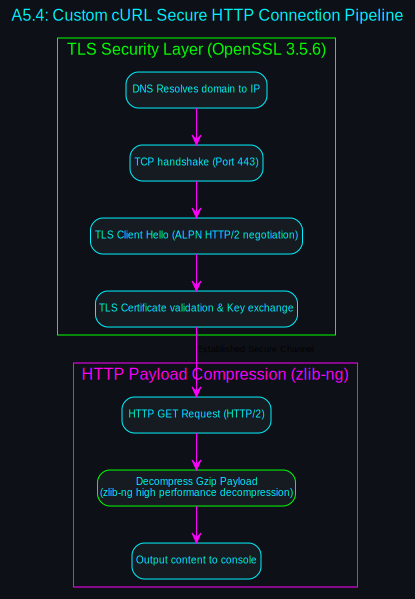 | 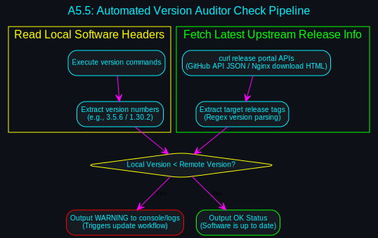 |

---

## 4. Maintenance & Diagnostic Tools

### 4.1. Upstream Version Auditor
To verify your running software against the latest remote releases, execute:
```bash
./session_20260529_123444/check_upstream_versions.sh
```
This script queries GitHub APIs and official releases to output a status report:
- `[OK] OpenSSL is up to date.`
- `[OK] cURL is up to date.`
- `[OK] OpenSSH is up to date.`
- `[OK] Nginx is up to date.`

### 4.2. Diagnostic Guides
Refer to our custom session folders for detailed steps:
- [Session Summary](file:///home/jeb/programs/gemini_cli_workspace/session_20260529_123444/session_summary.md): Step-by-step compilation walkthrough.
- [Maintenance & Troubleshooting Guide](file:///home/jeb/programs/gemini_cli_workspace/session_20260529_123444/maintenance_guide.md): Tips on overriding dynamic modules, editing systemd files, and using custom library paths in Python via `LD_LIBRARY_PATH`.
