<p align="center">
  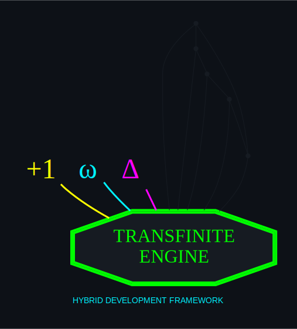
</p>

# Human-AI Hybrid Development Framework

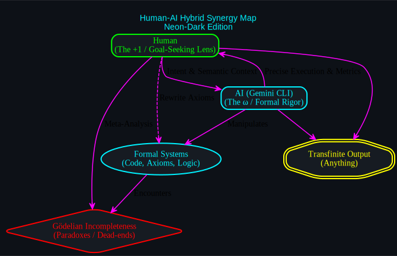

## Overview
This repository formalizes the **Human-AI Hybrid Loop**, a transfinite development methodology where human intuition and AI formal rigor combine to overcome Gödelian incompleteness.
### Core Philosophy
- **The Human ($+1$):** Provides the goal-seeking lens, semantic context, and the ability to step outside formal systems to rewrite axioms.
- **The AI ($\omega$):** Provides formal rigor, precise execution, massive state management, and syntax verification.

## Getting Started

1.  **Clone the Assembly:**
    ```bash
    git clone https://github.com/danindiana/hybrid-framework.git
    cd hybrid-framework
    ```

2.  **Verify the Pile of Parts:**
    Run the dependency audit to ensure your decades-old tools are synchronized:
    ```bash
    chmod +x setup.sh
    ./setup.sh
    ```

3.  **Initialize the HUD:**
    Launch the **Transfinite Controller** to begin your first hybrid session:
    ```bash
    python3 tools/controller.py
    ```

---

## Components

### 1. Hybrid Capability Assessment
A standardized diagnostic framework to measure the operational synergy between human collaborators and AI agents. It covers:
- **Semantic Translation:** Detecting drift from intent.
- **Meta-Systemic Agility:** Ability to refactor underlying axioms.
- **Heuristic Pruning:** Using aesthetics (elegance/simplicity) to navigate search spaces.
- **Operational Synergy:** Balancing entropy and formal constraints.

### 2. Ollama Token Forensics
Tools and methods for inspecting the internal state of local LLMs:
- **Streaming Inspection:** Visualizing text chunks via API.
- **Metric Verbosity:** Analyzing `eval rate` and `token counts`.
- **Tokenization:** Mapping text to raw token IDs for precise budget management.

### 3. rpi4 Livestream Management
A suite of tools for managing Hikvision-to-YouTube livestreams on Raspberry Pi hardware:
- **Telemetry Dashboard:** `stream-telemetry.sh` provides real-time stats on bitrate, frame drops, and connection stability.
- **Service Control:** Standardized `systemd` units for managing ingest and source circuits.
- **MOTD Integration:** Command references baked into the system login for rapid field management.

## Visual Architecture

### The System Overview Matrix (5x5)

| Pillar | S.1 | S.2 | S.3 | S.4 | S.5 |
| :--- | :--- | :--- | :--- | :--- | :--- |
| **Architecture** | 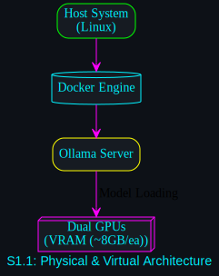 | 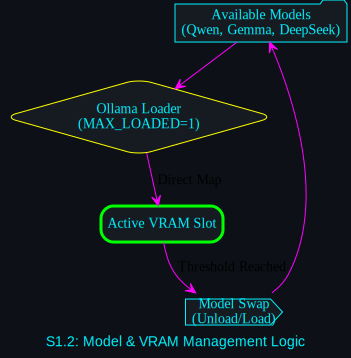 | 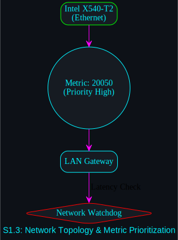 | 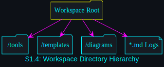 | 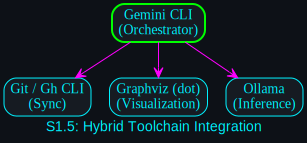 |
| **Lifecycle** | 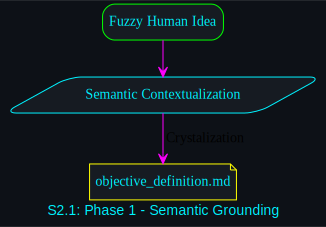 | 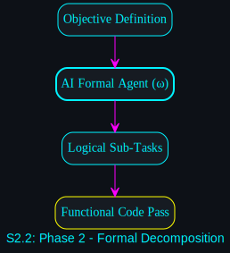 | 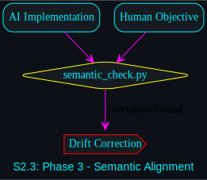 | 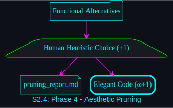 | 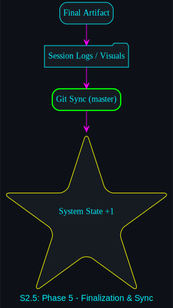 |
| **Coordination** | 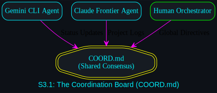 | 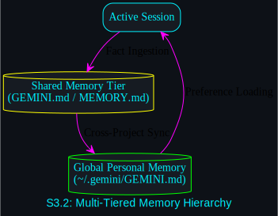 | 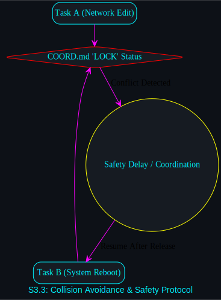 | 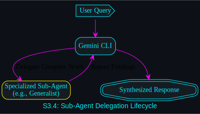 | 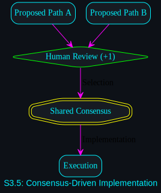 |
| **Forensics** | 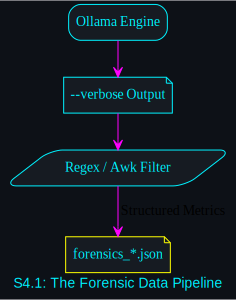 | 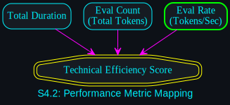 | 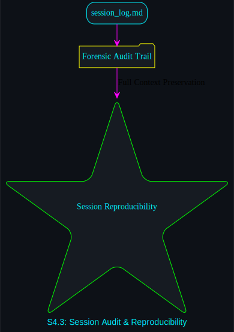 | 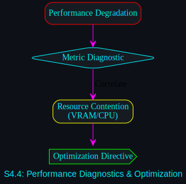 | 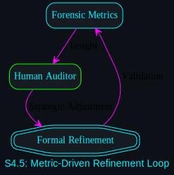 |
| **Evolution** | 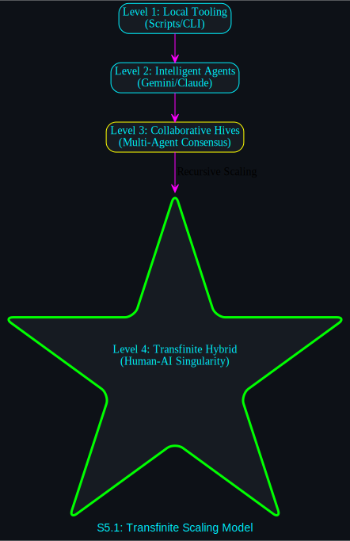 | 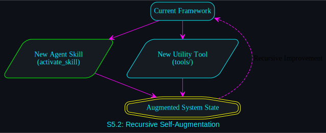 | 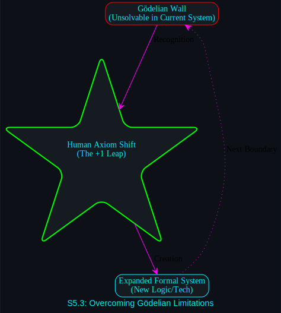 | 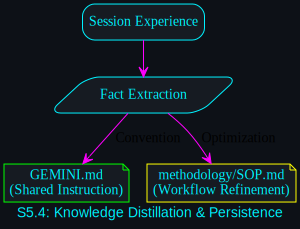 | 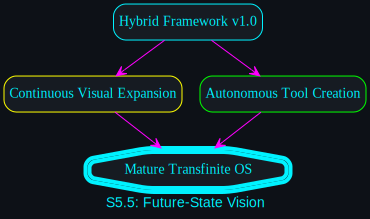 |

### The Transfinite Mechanics Matrix (5x5)

| Pillar | T.1 | T.2 | T.3 | T.4 | T.5 |
| :--- | :--- | :--- | :--- | :--- | :--- |
| **Meta-Observer** | 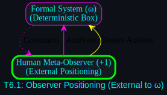 | 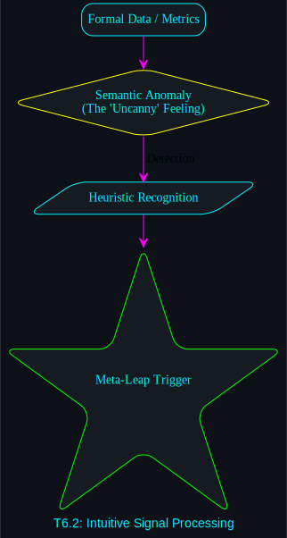 | 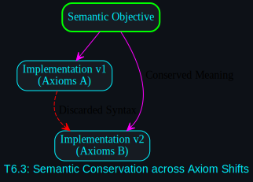 | 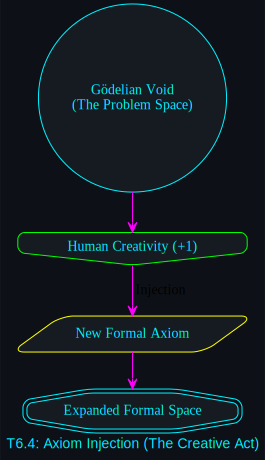 | 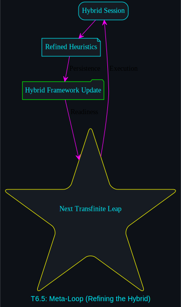 |
| **Axiom Dynamics** | 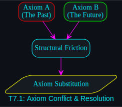 | 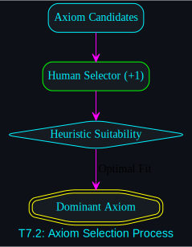 | 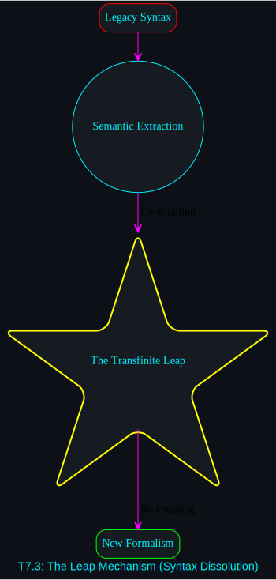 | 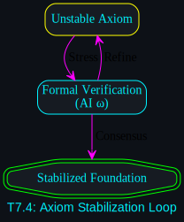 | 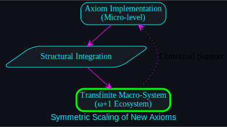 |
| **The ω Wall** | 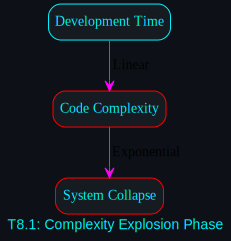 | 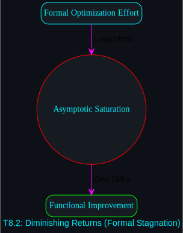 | 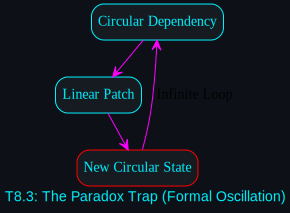 | 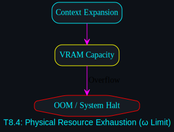 | 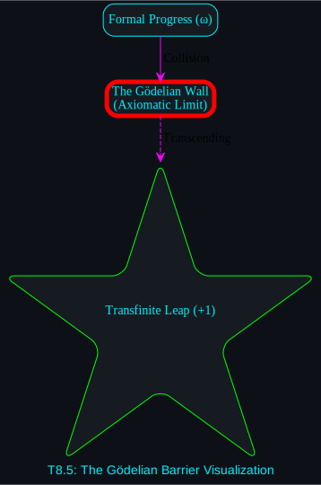 |
| **Augmentation** | 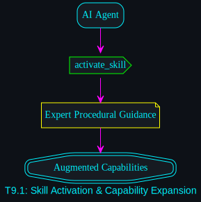 | 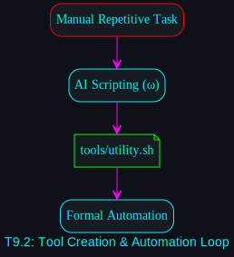 | 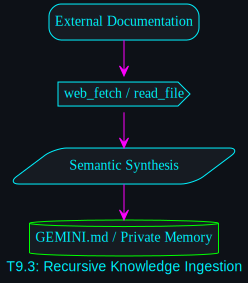 | 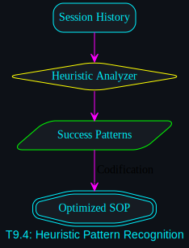 | 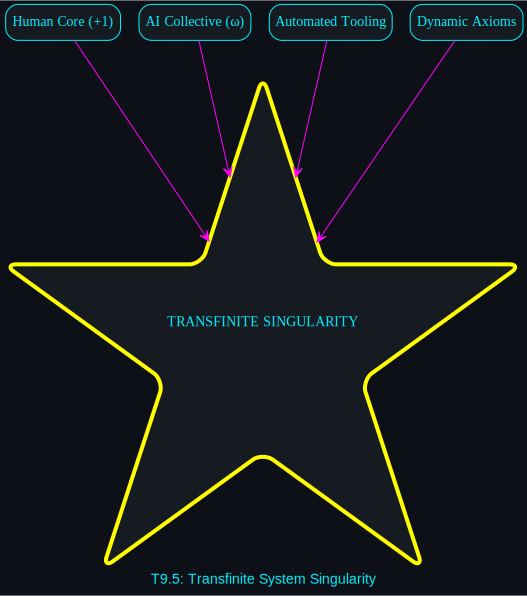 |
| **Verification** | 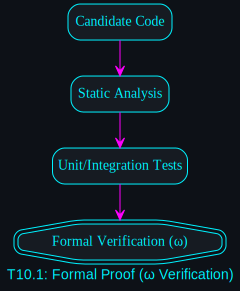 | 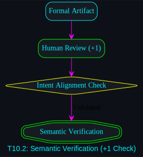 | 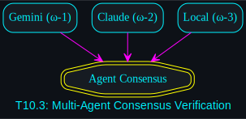 |  |  |

### The Expansion & Future State Matrix (5x5)

| Pillar | E.1 | E.2 | E.3 | E.4 | E.5 |
| :--- | :--- | :--- | :--- | :--- | :--- |
| **Proposed** |  |  |  |  |  |
| **Modules** |  |  |  |  |  |
| **Maintenance** |  |  |  |  |  |
| **Upgrade Path** |  |  |  |  |  |
| **Scenarios** |  |  |  |  |  |

### The Interface & Kineticism Matrix (5x5)

| Pillar | I.1 | I.2 | I.3 | I.4 | I.5 |
| :--- | :--- | :--- | :--- | :--- | :--- |
| **The Controller** |  |  |  |  |  |
| **Substrates** |  |  |  |  |  |
| **Forensics** |  |  |  |  |  |
| **Automation** |  |  |  |  |  |
| **Singularity** |  |  |  |  |  |

---

## Components

Detailed session notes and theoretical breakdowns are available in the `session_summary_*.md` files.
