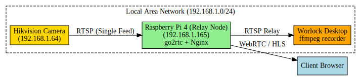
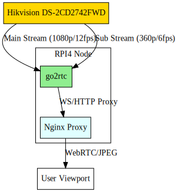
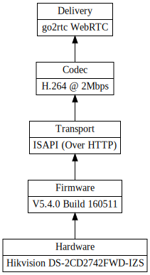
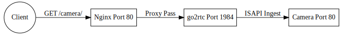
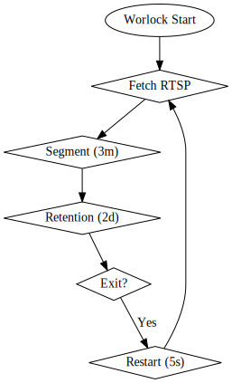

# AMPERE VISION

  

## Overview
**Ampere Vision** is a high-performance, low-latency Hikvision camera streaming and archival system. It leverages a Raspberry Pi 4 as a delivery node and a primary workstation (Worlock) for continuous high-fidelity archival.

## Architecture

### System Topology

The system is distributed across three primary nodes:
1.  **Hikvision Camera:** The source of truth (H.264 streams via ISAPI/RTSP).
2.  **Raspberry Pi 4:** The real-time delivery edge node running go2rtc and Nginx.
3.  **Worlock Desktop:** The archival node running a continuous ffmpeg segmentation loop.

### Data Flow

## Optimization Stack

To ensure smooth operation on RPI4 hardware, the camera firmware has been tuned to the following lightweight profiles:
- **Main Stream:** 1080p @ 12fps (2Mbps VBR)
- **Sub Stream:** 360p @ 6fps (256Kbps VBR)

## Network Ingress

The RPI4 provides a unified interface via Nginx proxy:
- **Web UI:** http://rpi4/camera/
- **WebRTC:** http://rpi4/camera/webrtc.html?src=camera_main
- **API:** http://rpi4/camera/api/

## Archival Logic

The hikvision-record.service on Worlock ensures zero-loss archival by splitting the stream into 3-minute MKV segments with a 2-day rolling retention policy.

---
*Maintained by danindiana*
