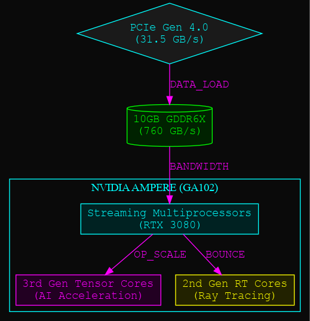
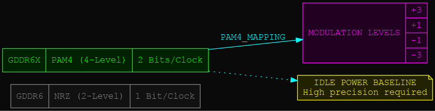
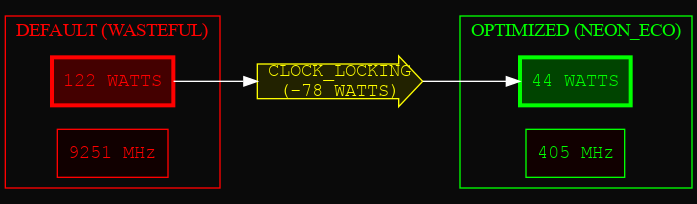
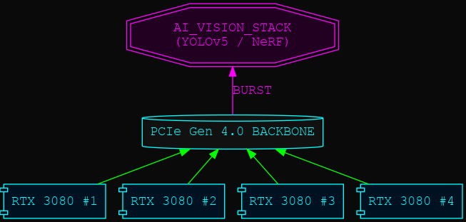
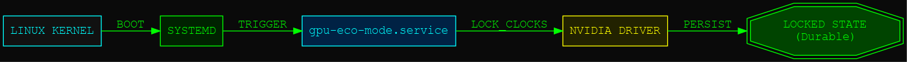

# 🌌 Neon Documentation
## High-Impact Architectural Visuals

This folder contains a specialized set of visualizations for the Ampere Archival project, utilizing a dark-mode neon aesthetic. These diagrams are designed to highlight the core technical pillars of the RTX 3080's architecture and the optimizations applied during this session.

---

### 1. 🏗️ Ampere Architecture (GA102)
A breakdown of the RTX 3080's internal silicon, emphasizing the relationship between Streaming Multiprocessors, Tensor Cores, and RT Cores.

---

### 2. 📡 GDDR6X Signaling (PAM4)
Visualizing the transition from binary (NRZ) to 4-level (PAM4) modulation, which doubled bandwidth but increased the power baseline.

---

### 3. 📉 Power Trench: The -78W Delta
A direct comparison of the "Before" (Wasteful) and "After" (Optimized) power states achieved through surgical clock locking.

---

### 4. 🚀 The Prosumer Vision Cluster
Architectural mapping of a multi-GPU vision rig leveraging PCIe Gen 4.0 for real-time AI workloads like YOLOv5 and NeRF.

---

### 5. 🛡️ Durable Persistence Architecture
The final software stack ensuring that optimizations survive system reboots through Systemd and the NVIDIA Persistence Daemon.

---

**Source:** All diagrams are generated from `.dot` files using the Graphviz engine with a custom neon theme.
