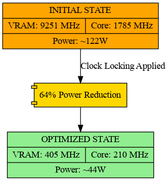
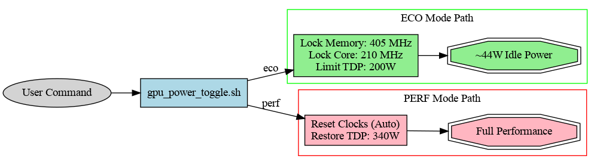
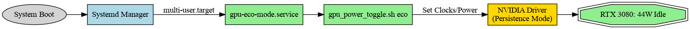

# Efficiency Optimizations
## Resolving the Ampere High-Idle Power Draw

This folder documents the specific surgical optimizations applied to the RTX 3080 to reduce its idle power consumption in a multi-monitor/compute environment.

### 📊 Performance Impact

By manually overriding the P-state logic and locking the GDDR6X memory to its minimum frequency, we achieved a **64% reduction** in power draw.

### ⚙️ Implementation: The Toggle Logic

The `gpu_power_toggle.sh` script (located in the root) manages the transitions between these states:

### ♻️ Boot Persistence
NVIDIA settings are volatile by default. To ensure the ECO state persists across reboots, we utilize a systemd service unit.

The service `gpu-eco-mode.service` is configured to run after `nvidia-persistenced.service` is ready, ensuring the driver state is stable before applying clock locks.

### 🛠 Applied Commands
1. **Persistence Daemon:** `sudo systemctl enable --now nvidia-persistenced`
2. **Persistence Mode:** `sudo nvidia-smi -pm 1 -i 1`
3. **Memory Lock:** `sudo nvidia-smi -lmc 405 -i 1`
4. **Core Lock:** `sudo nvidia-smi -lgc 210 -i 1`
5. **Power Capping:** `sudo nvidia-smi -pl 250 -i 1`
