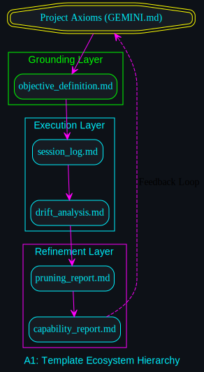
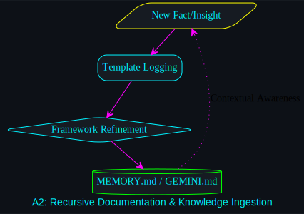
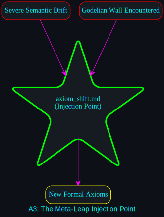
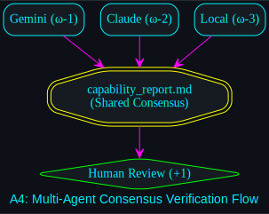
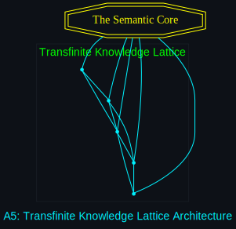

# Template Deep-Dive: Visualizing the Semantic Core

This directory contains the **5x5 Template Deep-Dive Matrix**, a granular mapping of the internal logic and semantic flows of the core documentation suite.

## Architectural Role
In the **Transfinite Development Model**, templates are not static documents; they are **Semantic Sensors** that detect state changes, Gödelian limits, and alignment drift. These diagrams visualize how data and intent move *inside* each document type.

### The Template Ecosystem
1. **Objective Definition:** The "Seed" of the session.
2. **Session Log:** The "Chronicle" of formal execution.
3. **Pruning Report:** The "Filter" for heuristic elegance.
4. **Drift Analysis:** The "Alarm" for semantic deviation.
5. **Capability Report:** The "Profile" of the human-AI pair.

## Navigation
Each `.dot` file corresponds to a specific internal mechanism, rendered in **Dark Neon** to maintain visual consistency with the Transfinite OS vision.

- **[View the 5x5 Matrix Logic](../../README.md#the-system-overview-matrix-5x5)**
- **[Explore the Visual Assets](./)**

---

## Over-arching Template Architecture

