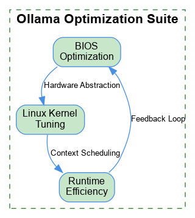
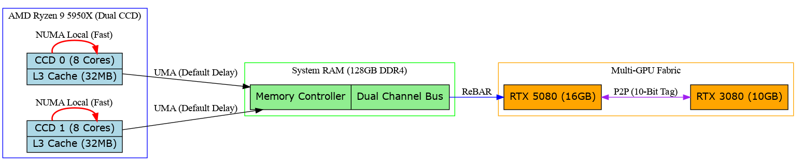

# Ollama Hardware & Runtime Optimization (ASRock X570 / Ryzen 5950X)

## Overview
This repository contains a comprehensive suite of BIOS and Linux kernel optimizations designed specifically for local Large Language Model (LLM) inference using **Ollama**. These optimizations target the unique architecture of the AMD Ryzen 5950X (Zen 3) and multi-GPU configurations (RTX 5080 + 3080).

## Optimization Architecture
The following diagram illustrates how the proposed changes optimize the data flow between CPU cores, System RAM, and the GPU fabric.

### Key Pillars of Optimization
1.  **NUMA Locality:** Splitting the 16-core CPU into two 8-core NUMA domains ensures threads stay close to their local 32MB L3 cache, minimizing latency across the Infinity Fabric.
2.  **PCIe Ten-Bit Tags:** Expands the number of concurrent outstanding PCIe requests, enabling seamless Peer-to-Peer (P2P) transfers between GPUs.
3.  **Kernel Memory Management:** Utilizes 1GB Hugepages to reduce TLB misses during multi-gigabyte weight accesses.
4.  **Runtime Thread Tuning:** Identifies the "sweet spot" for token generation, avoiding memory bandwidth saturation.

## Documentation
- [General BIOS Report](optimization_report.md): Initial baseline settings (XMP, PBO, ReBAR).
- [Advanced Tuning Deep-Dive](advanced_tuning_report.md): Technical instructions for NUMA, PCIe Tags, and Linux Kernel parameters.
- [Session Summary](session_summary.md): Overview of the research and findings.

## How It Works
LLM inference is primarily a **memory-bandwidth-bound** task. On a consumer platform like X570/AM4, the bottleneck is often the 2-channel memory bus or the latency incurred when data crosses between CCDs (Core Complex Dies).

By enabling **NUMA domain splitting**, we tell the Linux kernel to treat each CCD as a separate entity, ensuring that the `llama.cpp` backend (used by Ollama) schedules threads and memory locally. Furthermore, enabling **Ten-Bit Tag support** prevents the PCIe bus from "stalling" during heavy P2P communication between the two GPUs, which is essential for tensor-parallel execution of large models (35B+ parameters).

---
**Author:** danindiana
**Date:** 2026-05-14
