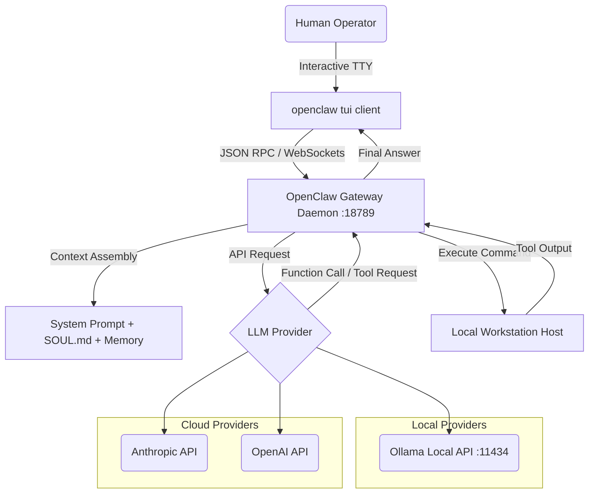

# OpenClaw Diagnostic & Setup Session Documentation
**Timestamp:** 2026-06-06T12:52:12-05:00  
**Machine:** worlock  

---

## Session Summary

Today we performed a full check, compilation, and environment verification for both the platform **OpenClaw** gateway and the **openclaw-tui** housing application. We downloaded and verified a fresh copy of the OpenClaw repository source code, launched the platform TUI in a GUI terminal (`kitty`), and researched the top 10 models for OpenClaw. 

This document serves as the primary log for today's session diagnostics, installation procedures, model matrix, local model configuration guides, lessons learned, and system architecture.

---

## 1. OpenClaw Platform Gateway Diagnostic
* **Active Daemon**: Node.js WebSocket Gateway is running on port `18789` (pid `4173`).
* **Active Model**: Configured primary model in `~/.openclaw/openclaw.json` is `ollama/qwen3-4b-chat` (warm context window `32768`).
* **Verification**: Queried dashboard port `18789` locally; returned the healthy Control UI frontend bundle successfully.

---

## 2. openclaw-tui (Housing Search) Restoration
* **Repository Verification**: Audited `~/Documents/claude_creations/2026-05-11T221006-openclaw-tui`. Clean git working directory, up-to-date with upstream.
* **Compilation & Re-Install**: Rebuilt the binary from clean source files using `cargo install` to resolve any local divergence:
  ```bash
  cargo install --path . --root ~/.local
  ```
  Binary correctly replaced at `~/.local/bin/openclaw-tui`.
* **Testing**: Launched and verified target rendering (correct default values: `$1000` max price, `14` days back, `"two small dogs"`).

---

## 3. Fresh OpenClaw Source Code & Onboarding Setup
* **Download**: Fetched release archive `v2026.5.22` from GitHub:
  * **URL**: `https://github.com/openclaw/openclaw/archive/refs/tags/v2026.5.22.zip`
  * **Size**: `57.56 MB`
  * **Verified SHA256 Checksum**: `022fdf06d7cdc236e86f3a118739ab4b7086b6f6ed0ca0e90aaa4524ac744ace`
* **Unpack Path**: Unzipped source to [openclaw-fresh/openclaw-2026.5.22](file:///home/jeb/Documents/claude_creations/openclaw-fresh/openclaw-2026.5.22).
* **Dev Onboarding**: Started an isolated developer profile onboarding flow on `DISPLAY=:0.0` in an interactive `alacritty` terminal:
  ```bash
  DISPLAY=:0.0 alacritty --title "OpenClaw Dev Onboarding" -e openclaw --dev onboard &
  ```
  This isolates configurations under `~/.openclaw-dev` so the main configuration `~/.openclaw` remains safe and untouched.

---

## 4. OpenClaw TUI Client Launch
* **Terminal**: Launched the OpenClaw platform TUI inside a hardware-accelerated terminal `kitty` on the operator's display for better color support and formatting:
  ```bash
  DISPLAY=:0.0 kitty --title "OpenClaw Chat TUI" openclaw tui &
  ```

---

## 5. Model Capability & Evaluation Report
We ran parallel searches and verified community reviews to find the top 10 models compatible with the OpenClaw framework:

| Model Name | Type / Provider | Tool-Calling Reliability | Latency (TTFT) | API Cost (1M In/Out) | Hardware / VRAM Req. | Key Strengths & Operator Notes |
| :--- | :--- | :--- | :--- | :--- | :--- | :--- |
| **Claude 3.5 / 4.6 Sonnet** | Cloud API (Anthropic) | **Outstanding** (98%+) | Moderate (~1.2s - 2.0s) | \$3.00 / \$15.00 | Cloud (0 GB) | The **gold standard** for OpenClaw. Outstanding at long-horizon planning and complex workspace file editing. |
| **Claude 3.5 / 4.6 Haiku** | Cloud API (Anthropic) | **Very High** (90%+) | Very Low (~0.4s - 0.7s) | \$0.80 / \$4.00 | Cloud (0 GB) | Highly cost-efficient; recommended for background routing, heartbeat tasks, or routine daemon logs. |
| **GPT-4o** | Cloud API (OpenAI) | **Outstanding** (96%+) | Low (~0.6s - 1.0s) | \$2.50 / \$10.00 | Cloud (0 GB) | Fast and extremely reliable function-calling. Matches Sonnet's execution capability on standard tools. |
| **Qwen3-Coder-30B-Instruct** | Local / API (Ollama) | **High** (89%+) | Low-Mod (~0.5s - 1.2s) | Free / \$0.30 / \$0.90 | Workstation (~20-24GB) | The **best open-weight local model** for development. Outstanding precision in codebase editing and bash scripts. |
| **Llama 3.3 70B Instruct** | Local / API (Ollama) | **Very High** (92%+) | Moderate (~1.5s - 2.5s) | Free / \$0.70 / \$0.90 | Dual-GPU (~40-48GB) | The primary choice for full local privacy. Requires robust hardware but behaves identically to top cloud APIs. |
| **DeepSeek-R1 (Qwen-32B Distill)** | Local / API | **High** (88%+) | High (~2.5s - 4.5s) | \$0.55 / \$2.19 | Workstation (~24GB) | Incredible step-by-step reasoning. *Note: `<think>` tag blocks can occasionally clutter the OpenClaw terminal stream unless explicitly suppressed.* |
| **Gemma 4 12B** | Local / API (Ollama) | **High** (85%+) | Very Low (~0.3s - 0.6s) | Free / \$0.10 / \$0.30 | Consumer GPU (~8-12GB) | Excellent lightweight local model. Highly optimized on-device operations with a minimal GPU footprint. |
| **Gemini 2.5 Flash** | Cloud API (Google) | **High** (88%+) | Low (~0.5s - 0.8s) | \$0.075 / \$0.30 | Cloud (0 GB) | Massive context capabilities at near-zero costs. Ideal for digesting massive codebase dumps or logs. |
| **Devstral 24B** (Mistral) | Local / API (Ollama) | **Medium-High** (82%+) | Low-Mod (~0.8s - 1.5s) | Free / \$0.20 / \$0.60 | Consumer GPU (~16-24GB) | Frequently configured as the default testbed model for verifying local extensions and custom tools. |
| **Command R+ (Latest)** | Cloud / API (Cohere) | **High** (88%+) | Moderate (~1.2s - 2.0s) | \$2.50 / \$10.00 | Enterprise (64GB+ VRAM) | Fine-tuned natively for multi-step agent actions. Excellent at web search and multilingual capability. |

---

## 6. How-To Guide: Local Model Configuration

For the operator running local models via **Ollama**, optimizing model configuration is critical to preventing out-of-memory errors (OOMs) and keeping processing times reasonable.

### A. Restricting Context to Save VRAM (Modelfile Fork)
Ollama allocates memory for the Key-Value (KV) cache based on the context size parameter (`num_ctx`). Large context windows can easily exceed workstation VRAM.

To restrict a model (e.g., `qwen3-4b-chat`) to a safe context size like `32768` (which fits standard OpenClaw system prompts + conversational history):

1. **Create a local Modelfile**:
   ```bash
   printf 'FROM qwen3:4b\nPARAMETER num_ctx 32768\n' > /tmp/qwen3-32k.modelfile
   ```
2. **Build the custom Ollama model**:
   ```bash
   ollama create qwen3-4b-chat -f /tmp/qwen3-32k.modelfile
   ```
3. **Register the primary model in OpenClaw config**:
   ```bash
   openclaw config set agents.defaults.model.primary ollama/qwen3-4b-chat
   openclaw config set agents.defaults.models.ollama/qwen3-4b-chat.params.num_ctx 32768 --strict-json
   ```

### B. Disabling System Heartbeats (Preventing Context Contamination)
OpenClaw routinely polls the workspace state to trigger event actions. This "heartbeat" message contaminates the model's history context buffer. For local systems, it is recommended to disable it:
```bash
openclaw system heartbeat disable
```

### C. Installing and Setting up Extension Search (DuckDuckGo)
OpenClaw bundles a DuckDuckGo search extension, but it must be manually installed and configured to avoid external search API cost/keys:

1. **Install the plugin**:
   ```bash
   openclaw plugins install duckduckgo
   ```
2. **Set DDG as active provider**:
   ```bash
   openclaw config set tools.web.search.provider duckduckgo
   ```
3. **Restart the Gateway**:
   ```bash
   openclaw gateway restart
   ```

---

## 7. Lessons Learned & Troubleshooting

1. **TTY Requirement**: Both interactive TUIs (`openclaw tui` and `openclaw-tui`) require a real interactive terminal shell and fail with `Error: No such device or address (os error 6)` if run inside automated tasks without standard I/O redirection. Always launch them wrapped in an actual emulator (`kitty` or `alacritty`).
2. **Incorrect DISPLAY Specification**: Launching GUI terminals from background script triggers fails if the active X11 screen parameters are wrong. On this workstation (`worlock`), the default `:0` is not active; we must target `DISPLAY=:0.0` (as mapped by the user's active XFCE session).
3. **Auth Token Errors**: Running `openclaw --dev tui` without configuration can lead to `Missing gateway auth token` errors because the isolated `--dev` environment lacks active secrets. Set `OPENCLAW_GATEWAY_TOKEN` or run onboarding first inside the dev profile.
4. **Heartbeat Pollution**: Automated heartbeat daemons poll the workstation environment state every 30 minutes, filling up local LLM context windows with duplicate system data. Disabling heartbeats preserves memory buffers.

---

## 8. OpenClaw System Architecture

OpenClaw operates as a decentralized, API-driven agent broker:



* **Gateway Daemon**: A Node.js server that manages active user sessions, pairs devices, schedules cron-based agent tasks, and serves the browser-based Control UI dashboard.
* **TUI Client**: A terminal-based messaging client that renders active output and handles user input, connecting dynamically via standard WebSockets.
* **Prompt Assembly Pipeline**: Concatentates workspace files (`IDENTITY.md`, `USER.md`, `SOUL.md`), active conversation history, and dynamically generated JSON schemas for all enabled tools into a single context payload sent to the LLM.
* **Tool Dispatcher**: Runs requested processes, filesystems edits, or web scraping tools on the local machine and returns stderr/stdout outputs to the inference engine.
