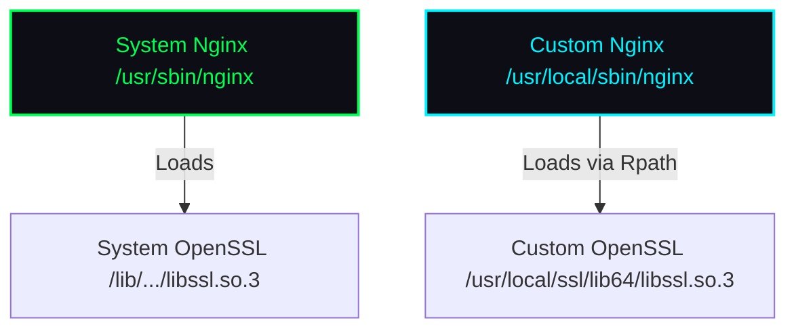

# Session Summary: Upstream Software Compilations & Deconfliction

**Date:** 2026-05-29 12:34:44 (Local Time)  
**Session Directory:** [session_20260529_123444](file:///home/jeb/programs/gemini_cli_workspace/session_20260529_123444)  
**User:** jeb  
**Host:** worlock  

---

## 1. Overview & Objective

This session was dedicated to compiling and installing upstream, secure releases of core system components (**OpenSSL**, **zlib-ng**, **cURL**, **OpenSSH**, and **Nginx**) from verified source tarballs. 

The primary goal was to upgrade these components to their latest upstream releases to obtain the latest CVE fixes and protocol features, while completely preserving existing OS configurations and deconflicting paths so that the default system package integrity and stability remain untouched.

---

## 2. Compilation and Linkage Architecture

To prevent dynamic library version conflicts (such as the `OpenSSL version mismatch` assertion that crashes Ubuntu's packaged Nginx), we adopted an **Isolated Rpath Linkage** strategy:
- We did **not** register `/usr/local/ssl/lib64` or `/usr/local/zlib-ng/lib` in system-wide dynamic linker configuration (`/etc/ld.so.conf.d/`).
- Instead, we configured the compiler to bake the runpath (`rpath`) directly into the custom binaries using `-Wl,-rpath`.
- This ensures that our custom binaries (`openssl`, `curl`, `ssh`, `nginx`) locate their matching libraries directly in `/usr/local/` prefix paths without affecting system binaries which continue to use the OS-packaged libraries in `/lib/x86_64-linux-gnu`.



---

## 3. Component Details & Steps Executed

### 3.1. OpenSSL 3.5.6 (LTS)
- **Source URL:** `https://github.com/openssl/openssl/releases/download/openssl-3.5.6/openssl-3.5.6.tar.gz`
- **Hash Verification:** Verified SHA256 `deae7c80cba99c4b4f940ecadb3c3338b13cb77418409238e57d7f31f2a3b736`.
- **Configure Option:** `./config --prefix=/usr/local/ssl --openssldir=/usr/local/ssl shared zlib-dynamic -Wl,-rpath,/usr/local/ssl/lib64`
- **Testing:** Ran full test suite (`make test`). All 4,505 checks passed successfully.
- **Symlinks:** Created `/usr/local/bin/openssl` and `/usr/local/bin/openssl35` pointing to `/usr/local/ssl/bin/openssl`.

### 3.2. zlib-ng 2.3.3 (High-performance Compression)
- **Source URL:** `https://github.com/zlib-ng/zlib-ng/archive/refs/tags/2.3.3.tar.gz`
- **Hash Verification:** Verified SHA256 `f9c65aa9c852eb8255b636fd9f07ce1c406f061ec19a2e7d508b318ca0c907d1`.
- **Configure Option:** `./configure --prefix=/usr/local/zlib-ng --zlib-compat` (exposes standard zlib API/ABI symbols for compatibility).

### 3.3. cURL 8.20.0
- **Source URL:** `https://curl.se/download/curl-8.20.0.tar.gz`
- **Hash Verification:** Verified SHA256 `fc5819cad3f9f5482669adcdc49a782c15f36d2a0715b395b06d9173593d2dc0`.
- **Configure Option:** `LDFLAGS="-Wl,-rpath,/usr/local/ssl/lib64 -Wl,-rpath,/usr/local/zlib-ng/lib" ./configure --prefix=/usr/local/curl --with-openssl=/usr/local/ssl --with-zlib=/usr/local/zlib-ng`
- **Symlinks:** Overwrote legacy manual binary at `/usr/local/bin/curl` with symlink to `/usr/local/curl/bin/curl`.

### 3.4. OpenSSH 10.3p1
- **Source URL:** `https://cdn.openbsd.org/pub/OpenBSD/OpenSSH/portable/openssh-10.3p1.tar.gz`
- **Hash Verification:** Verified SHA256 `56682a36bb92dcf4b4f016fd8ec8e74059b79a8de25c15d670d731e7d18e45f4`.
- **Backup:** Copied configurations to `/etc/ssh.bak/`.
- **Configure Option:** `LDFLAGS="-Wl,-rpath,/usr/local/ssl/lib64" ./configure --prefix=/usr/local/ssh --sysconfdir=/etc/ssh --with-ssl-dir=/usr/local/ssl --with-pam` (PAM support enabled to prevent `UsePAM` syntax failures).
- **Systemd Override:** Directed systemd to execute `/usr/local/ssh/sbin/sshd` via `/etc/systemd/system/ssh.service.d/override.conf`.

### 3.5. Nginx 1.30.2 (Stable)
- **Source URL:** `https://nginx.org/download/nginx-1.30.2.tar.gz`
- **Hash Verification:** Verified SHA256 `7df3090907fca3cc0e456d6dc00ceb230da74ea88026ceff0affc29dbbd9ac4c`.
- **Backup:** Copied configurations to `/etc/nginx.bak/`.
- **Deconfliction:** Inactive dynamic modules compiled for 1.18.0 were moved from `/etc/nginx/modules-enabled/` to `/etc/nginx/modules-disabled/` to avoid version startup blocks.
- **Configure Option:**
  ```bash
  ./configure --prefix=/usr/share/nginx --sbin-path=/usr/local/sbin/nginx --conf-path=/etc/nginx/nginx.conf \
    # ... http SSL, gzip, rewrite modules ...
    --with-cc-opt="-I/usr/local/ssl/include -I/usr/local/zlib-ng/include" \
    --with-ld-opt="-Wl,-rpath,/usr/local/ssl/lib64 -Wl,-rpath,/usr/local/zlib-ng/lib -L/usr/local/ssl/lib64 -L/usr/local/zlib-ng/lib"
  ```
- **Systemd Override:** Directed systemd to execute `/usr/local/sbin/nginx` via `/etc/systemd/system/nginx.service.d/override.conf`.

---

## 5. Verification Details

All components were successfully tested:
1. **cURL:** Running `curl --version` outputs:
   `curl 8.20.0 (x86_64-pc-linux-gnu) libcurl/8.20.0 OpenSSL/3.5.6 zlib/1.3.1.zlib-ng ...`
2. **OpenSSH:** Running `ssh -V` outputs `OpenSSH_10.3p1, OpenSSL 3.5.6 7 Apr 2026`. `ssh` daemon is actively listening on Port 22222 with successful configuration validation (`sshd -t`).
3. **Nginx:** Running `nginx -V` reports `nginx version: nginx/1.30.2` and `built with OpenSSL 3.5.6`. Config file syntax check test is successful.
4. **Permissions:** Restored global read and execute access (`chmod -R go+rX`) to `/usr/local/ssl`, `/usr/local/zlib-ng`, `/usr/local/curl`, and `/usr/local/ssh`.

---
*Generated by Antigravity CLI*
