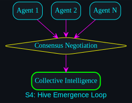

# Singularity Mechanic: Hive Emergence

## Definition
**Hive Emergence** is the state where multiple AI agents (Gemini, Claude, Llama, etc.) collaborate autonomously under a shared semantic directive. It is the transition from "Tool Use" to "Collective Intelligence."

## The Emergence Loop

### 1. Consensus Negotiation
When a complex task is issued, the agents do not work in isolation. They use the `COORD.md` board to propose solutions. If Agent A (Gemini) proposes a path, Agent B (Claude) audits it. They negotiate until a **Consensus Path** is reached.

### 2. Specialized Roles
The hive automatically assigns roles based on the forensic performance of each model:
- **Lead Generator:** High-creativity models for initial drafts.
- **Critical Auditor:** High-precision models for bug detection.
- **Semantic Validator:** Context-aware models for alignment checks.

### 3. Unified Intelligence
To the human operator (+1), the hive appears as a single, ultra-intelligent entity. The internal debates of the models are hidden behind a **Synthesized Result**.

## Benefits
- **Cross-Verification:** Errors made by one model are caught by the others.
- **Aggregated Knowledge:** The system leverages the combined training data of every model in the collective.
- **Resilience:** If one model goes offline or hallucinates, the hive maintains its functional state.
