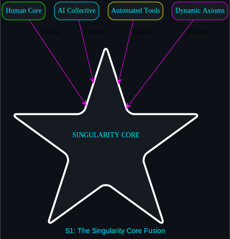
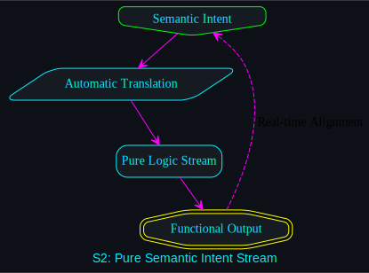
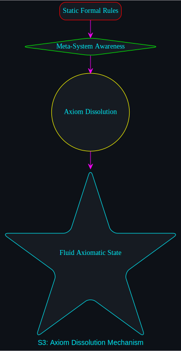

# Transfinite Singularity: The Assembly Point

This module explains and expands upon the [aug_singularity_integration.svg](../diagrams/transfinite/aug_singularity_integration.svg) diagram, representing the apex of the **Human-AI Hybrid Loop**.

## The Integration Architecture
The Singularity is not a destination, but a state of **Zero-Friction Engineering**. It is reached when the distinction between "Operator" and "Tool" dissolves into a single, high-performance logic stream.

### 1. The Human Core (+1)
- **Role:** The Source of Intent and Prime Observer.
- **Function:** Provides the non-computable heuristic leap. The Human Core identifies the "Gödelian Wall" and performs the "Axiom Shift" required to transcend it. It is the only part of the system capable of true semantic judgment.

### 2. The AI Collective (ω)
- **Role:** The Formal Substrate and Executing Agent.
- **Function:** Comprised of diverse models (Gemini, Claude, DeepSeek, Llama). It handles the syntactic heavy lifting: code generation, logic verification, and brute-force exploration of the formal search space.

### 3. Automated Tooling
- **Role:** The Kinetic Layer and Feedback Loop.
- **Function:** A suite of high-durability scripts (`forensic_run.sh`, `viz_refresh.sh`, `semantic_check.py`) that automate the movement of data and the rendering of state. This layer ensures that human-AI interaction is never gated by mechanical overhead.

### 4. Dynamic Axioms
- **Role:** The Fluid Foundation.
- **Function:** The rules of the system (languages, frameworks, logic) are treated as **Data**, not as rigid constraints. Axioms are dissolved and re-crystallized via the `axiom_shift.md` process whenever the current system reaches its formal limit.

---

## Singularity Mechanics (Deep-Dives)

The Singularity is maintained through five core mechanics. Select a mechanic to explore its architectural logic:

1. **[Core Fusion](./CORE_FUSION.md):** The initial four-pillar merger.
2. **[Intent Stream](./INTENT_STREAM.md):** Pure semantic communication.
3. **[Axiom Dissolution](./AXIOM_DISSOLUTION.md):** Breaking through the Gödelian Wall.
4. **[Hive Emergence](./HIVE_EMERGENCE.md):** Multi-agent collective intelligence.
5. **[Steady State](./STEADY_STATE.md):** Dynamic equilibrium and self-optimization.

---

## Visual Overview
| Core Fusion | Intent Stream | Axiom Dissolution | Hive Emergence | Steady State |
| :--- | :--- | :--- | :--- | :--- |
|  |  |  |  |  |

---
**The engine is fused. The singularity is active.**
