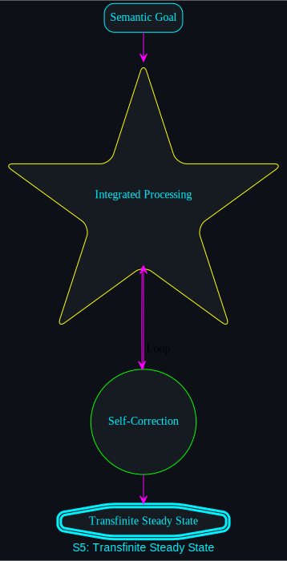

# Singularity Mechanic: Transfinite Steady State

## Definition
The **Steady State** is the final, stable operating mode of the Transfinite Singularity. It is a state of "Dynamic Equilibrium" where the framework is continuously auditing itself, correcting drift, and optimizing performance.

## The Audit Cycle

### 1. Continuous Forensic Scanning
The system runs `forensic_run.sh` on every execution, extracting metadata on token rates, entropy, and duration. This data is fed into a live dashboard (the HUD).

### 2. Recursive Self-Optimization
The framework uses its own tools to rewrite its own tools. If `viz_refresh.sh` is slow, the system triggers a task to optimize the script's logic.

### 3. Immutable Semantic Alignment
While the code changes constantly, the **Semantic Baseline** is protected. Every iteration must pass a 90% alignment check via `semantic_check.py` to be promoted to the master branch.

## Conclusion
A system in the Steady State is **"Done but not Finished."** It is complete enough to be functional, but fluid enough to be eternal. It behaves more like a biological organism than a piece of software.

---

### Total System Health
- **Entropy:** Minimal (Controlled).
- **Alignment:** Maximal (Synchronized).
- **VRAM HUD:** Online.
- **Transfinite Engine:** Active.
